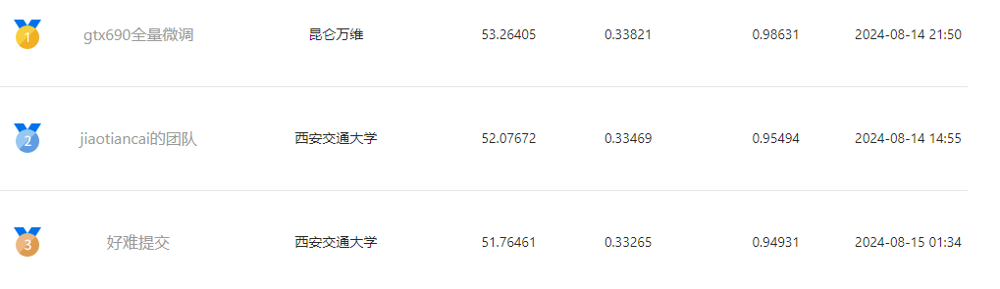
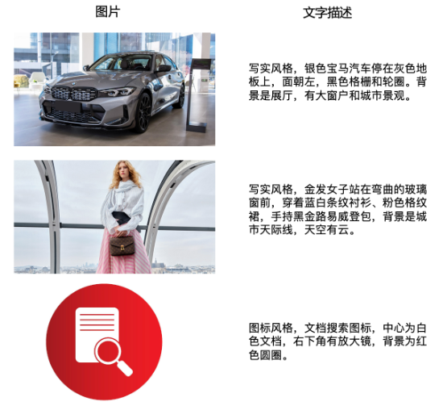
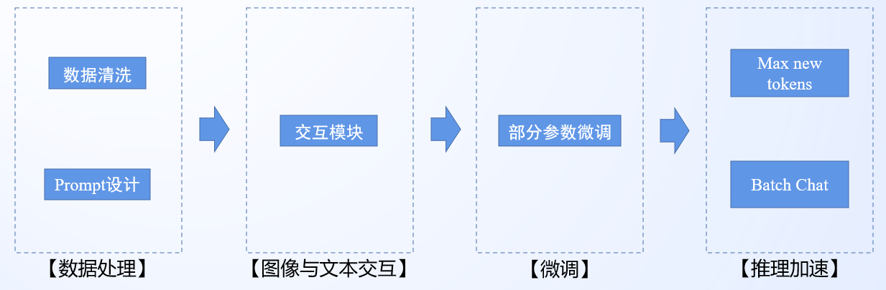
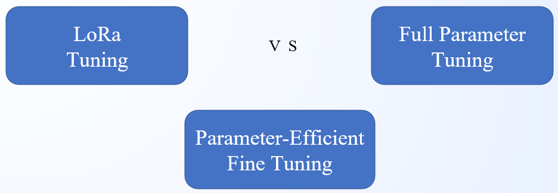
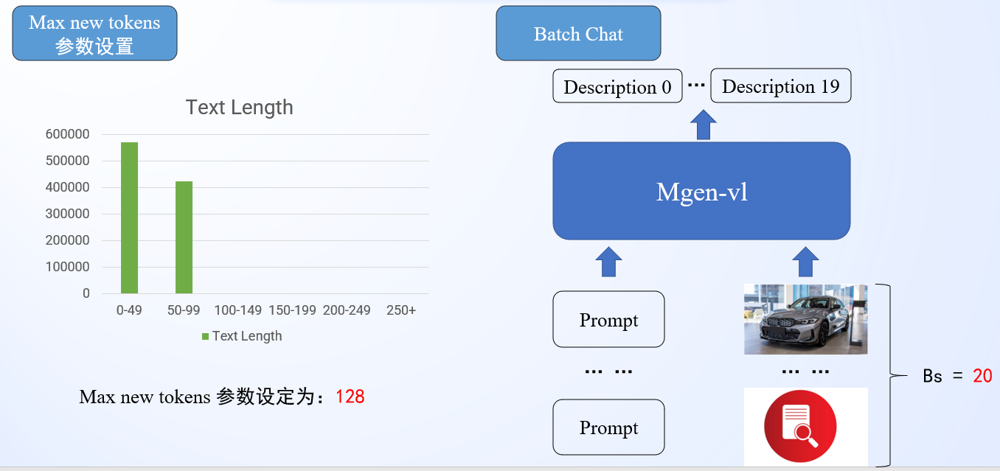

# 百度商业AI技术创新大赛赛道二：广告图片描述生成Rank3方案分享
**Team：鲜衣怒马少年时 (好难提交)** 

**Author：Ambrose**


## 📝赛题背景
在百度商业营销场景，广告图片生成精细化描述具有重要意义和价值。图片描述信息（Image Caption），可以作为特征丰富广告系统对多模态内容的理解，提升模型的泛化能力，也可以为文生图模型提供高质量的训练样本，提升文生图模型的文本控制能力。当前，随着大模型时代的到来，利用多模态大语言模型（MLLM）生成图片描述已经成为业界的通用做法（DallE3，Sora, Stable Diffusion3）。本赛道任务是广告图片描述生成，期望通过高质量数据和建模优化，提升图片描述的准度和完备性。

[//]: # (## 📚赛题详情)
## 📢数据说明
本次任务提供百度商业真实的广告图片和图片中文描述，数据量级约100万，参赛者自行划分训练集和验证集。 每条样本数据包括了三列，采用tab分割，分别为： * 图片id * 图片base64编码 * 图片的文字描述。如下图所示，通常包括了对图片中各个主体（人物的外貌、衣着、表情、物体颜色）、主体之间关系、背景、风格等细粒度描述。



[//]: # (## 🤖评分规则)

## 💡解题思路
基于任务描述，该赛题属于广告描述场景下的多模态大语言模型MLLM微调任务。基于该任务特性我们设计如下的解决方案：


1. **数据处理模块：**

- 数据清洗：通过观察广告图文数据对中的文本描述可以发现，图片描述中存在特定的规律，即均包含“xx风格”这样的描述。并且如赛题描述广告图片描述由：图片风格、图片中各个主体的特征、主体之间的关系和图片背景组成。因此我们通过规则剔除不包含图片风格的图文对数据。
- Prompt设计
```bash
请总结图片的图片风格并描述图片内容。其中图片风格例如：写实风格、图标风格、像素风格、水彩风格、卡通风格、插画风格、黑白简笔风格、中国风风格、纯文字风格、艺术风格、素描风格、3D风格、科技风格等。图片内容包括：图片中各个主体的特征、主体之间关系和图片背景。注意描述内容需要具有准确性、连贯性和简洁性。因此该图片的图片风格和描述内容为：
```

2. **图像文本交互模块：**
考虑到该赛题所给的baseline中存在bug，即训练过程中没有用到图像数据，只在推理中用到了图像数据。因此我们需要了解MLLM中图像和文本是如何进行交互的。如下图所示，我们给出了本赛题所给的Mgen-vl的图文交互方式：


从图中可以看出，训练过程中，进入大语言模型Mgen之前的图文特征由四部分组成：文本前缀编码特征 + 图像嵌入特征 + Prompt编码特征 + Answer。其中“Image Tokens”需要在文本嵌入中预留出256位的图像占位符以供后续图像特征通过**paddle.scatter**进行替换。

3. **Mgen-vl微调模块：**


针对本赛题的任务，可以选择的微调方式由LoRa微调（baseline）、全参数微调和部分参数微调。从数据量和计算资源考虑，最终选择了部分参数微调的方式。

- 本赛题提供了近百万的图文对训练数据，训练数据充足
- 通常在数据充足的情况下全参数微调效果要优于LoRa和部分参数微调，考虑到计算资源有限，最终选择了折中方案：部分参数微调（transformer.llm.h.16 - transformer.llm.h.31）

4. **推理加速模块：**


- 统计训练数据中图像描述文本的长度分布，最终选择Max new tokens参数值为128，极大缩短推理时间
- 实现Batch Chat推理接口，一次性推理多个样本

## 🌟代码运行说明
```bash
# MLLM微调
cd paddlemix
## 数据预处理
python tools/convert_labels.py ./data/caption_train_data/merged_train_id_base64_cap ./data/ambrose_prompt/
## 模型微调
CUDA_VISIBLE_DEVICES=0 python supervised_finetune.py config/mgen_vl/lora_sft_argument.json

# MLLM推理
cd paddlemix
## 模型merge
CUDA_VISIBLE_DEVICES=0 python merge_local_params.py --model_name_or_path  /data/wsc/adImageCaption/pretrained_models/mgen-vl-chat-7b \
    --lora_path /data/wsc/adImageCaption/checkpoints/mgen_vl_sft_ckpts_clip/checkpoint-30000 \
    --merge_model_path ../checkpoints/mgen_vl_merge_local

## 模型推理 
CUDA_VISIBLE_DEVICES=0 python predict_batch.py ./test_samples.txt ./test/results.txt /data/wsc/adImageCaption/pretrained_models/mgen-vl-chat-7b/
```

## 🎉总结
该赛题关键在于了解多模态大语言模型MLLM的运行机制，针对数据做定向清洗、模型图文交互模块设计以及推理加速设计。

对推理加速有兴趣的同学可以关注一下“多头解码” (multi-token decode)